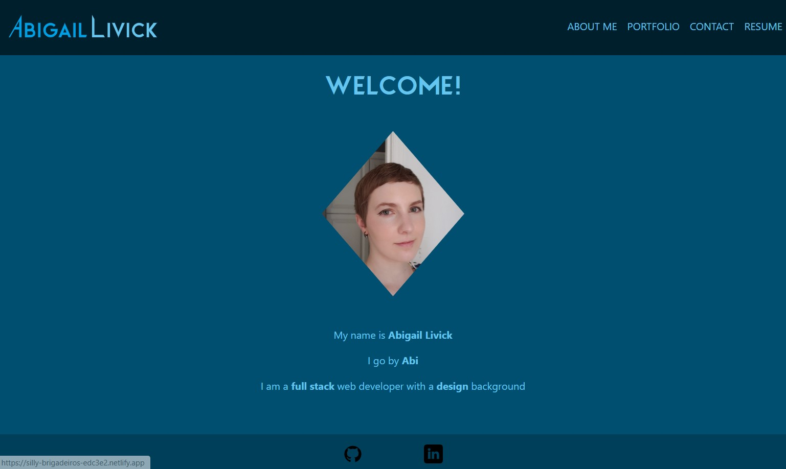

# 20-React-Portfolio

## Description

  A personal portfolio site to showcase my coding work. Site is responsive, with multiple pages accessed through the nav bar. Portolio page contains cards of past projects with links to deployed application(of applicable) and their github repositories.

  

  [Deployed Site](https://silly-brigadeiros-edc3e2.netlify.app/)

  
## Table of Contents

  1. [Installation](#installation)
  2. [Usage](#usage)
  3. [License](#license)
  4. [Contribution](#contribution)
  5. [Testing](#testing)

## Installation

  n/a

## Usage

  n/a

## License

  n/a

## Contribution

  n/a

## Testing

  n/a

## Questions
  Email me at [abilivick@gmail.com](mailto:abilivick@gmail.com) or explore more projects at [lailiel](https://www.github.com/lailiel)